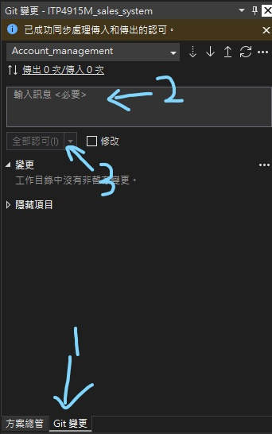
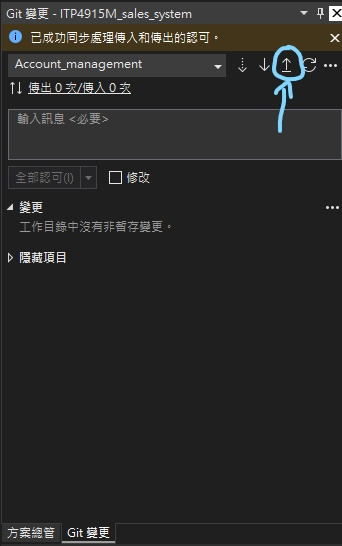
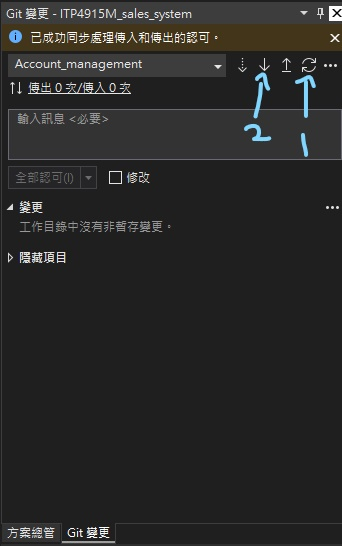
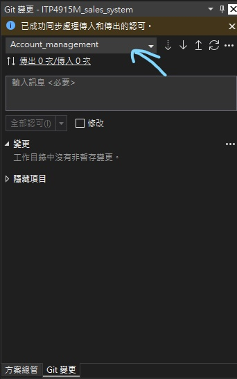
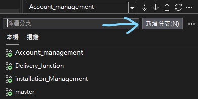
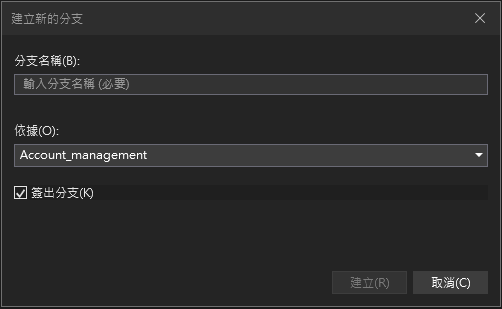
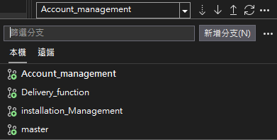
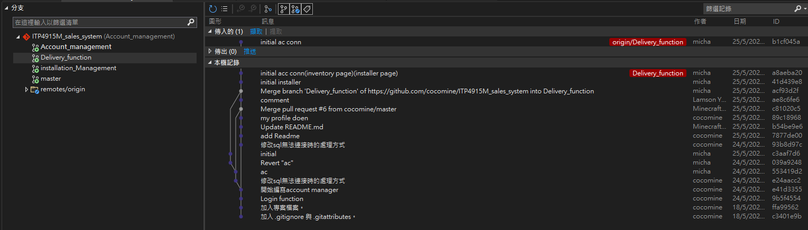
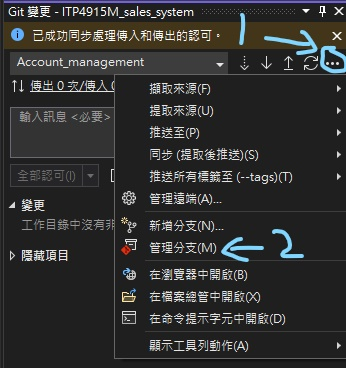

How To Use Git
===
建立commit(認可)
---
當你更改檔案後, 你需要進行 *commit* 後, 才可以推送至GitHub

> 什麼時候進行 *commit*? 
> 你已經完成咗一個功能或者修復咗一個功能, 就可以進行了 
> 如果仍然不知道什麼時候進行, 最簡單的方法就是關閉Visual studio不想再編寫時進行

#### 建立步驟
1. 當你的檔案完成更改後, 前往 *Git變更*
2. 在 *輸入訊息* 位置填寫你這段時間進行的更改簡要
3. 點選 *全部認可* 

Push至GitHub(推送)
---
將更改推送至GitHub, 你需要先進行 *commit* 後, 才可以推送至GitHub

> 你需要先 *Push* 至GitHub, 才可以與其他人共用

#### 推送步驟
1. [先進行 *commit*](#建立commit認可)
2. 點擊 *推送* 按鈕 

Pull GitHub上的更新(提取)
---
若果GitHub上面有更新的檔案, 您需要先提取到本機

> 要先提取到本機才, 可以更改, 以免發生衝突問題 
> 確保本機的所有更改, 已經*commit*並*Push*到Github, 否則你無法提取

#### 提取步驟
1. 先按下 *同步* 按鈕與GitHub同步commit紀錄
2. 按下 *提取* 按鈕 

增加branch(分支)
---
每一個分支之間的更改紀錄不會共用, 在當前分支更改檔案亦不會導致其他分支有檔案衝突的問題

> 建議每寫一個功能就建立一個新分支 
> 檔案衝突問題會再合併(merge)時候才處理 
> 建議不要在*master*分支上更改檔案, 盡有可能在子分支上更改 
> 如果仍然需要再*master*分支上更改檔案, 請先與組員溝通

#### 增加步驟
1. 點擊下圖所示的下拉式選單 

2. 點擊*新增分支* 

3. *依據*欄位可以選擇從哪一個分支中增加一個新分支
> 分支名稱, 避免無意義的字詞

轉換其他分支
---
每個分支之間的檔案紀錄並不通用, 確保更改檔案前, 在你想要的正確分支上

#### 轉換步驟
1. 點擊下圖所示的下拉式選單 

2. 選擇您想要的分支 

 > 若果在這裏看不到你想要的分支 
 > 可以切換到*遠端*點擊後, 將會自動提取到本機 
 > 

管理所有分支及commit
---
Visual Studio自帶介面可以查看所有分支及所有commit
> 在這裏可以進行更加多的進階操作

#### 前往步驟
1. 點擊下圖所示按鈕
2. 點擊 *管理分支* 

